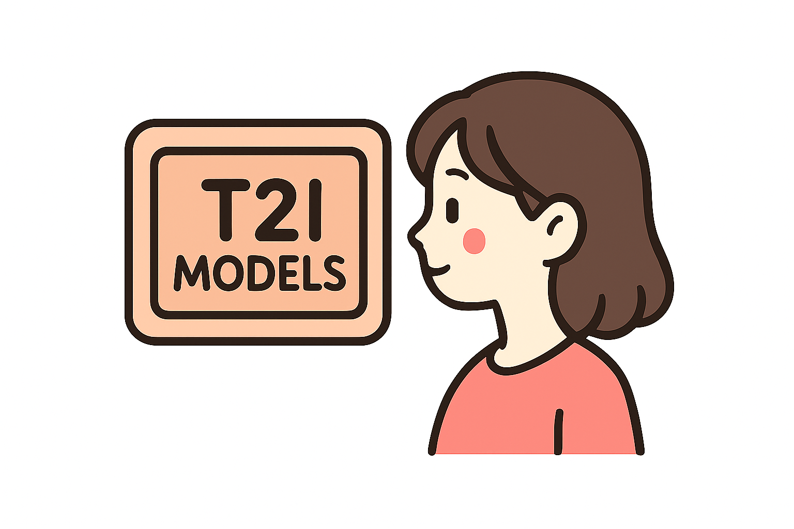

# 🌟Awesome TEXT-TO-IMAGE Models

  
  <h1 align="center">Overview</h1>
  

  

  
<em>A curated collection of resources focused on Bias in Text-to-Image Models.</em>

## Table of Contents
- [Surveys](#-surveys)
- [Papers](#-papers)
  - [Cultural Bias](#-cultural-bias)
  - [Social Bias](#-social-bias)
- [Conferences](#-Conferences)

<!--- 
## 📚 Surveys:
([Back to Table of Contents](#Table-of-Contents))
+ [A Survey on Sparse Autoencoders: Interpreting the Internal Mechanisms of Large Language Models](https://arxiv.org/abs/2503.05613) (Jun. 06, 2025)
  
  
+ [A Survey on Mechanistic Interpretability for Multi-Modal Foundation Models](https://arxiv.org/abs/2502.17516) (Feb. 22, 2025)
  

+ [Open Problems in Mechanistic Interpretability](https://arxiv.org/abs/2501.16496) (Jan. 27, 2025)
  

+ [A Review of Multimodal Explainable Artificial Intelligence: Past, Present and Future](https://arxiv.org/abs/2412.14056) (Dec. 18, 2024)
  

+ [Explainable and Interpretable Multimodal Large Language Models: A Comprehensive Survey](https://arxiv.org/abs/2412.02104) (Dec. 3, 2024)
  

## 📚 Blog:
([Back to Table of Contents](#table-of-contents))
+ [Mechanistic Interpretability Meets Vision Language Models: Insights and Limitations](https://d2jud02ci9yv69.cloudfront.net/2025-04-28-vlm-understanding-29/blog/vlm-understanding/) (Apr. 28, 2025)

+ [Are SAE features from the Base Model still meaningful to LLaVA?](https://www.lesswrong.com/posts/8JTi7N3nQmjoRRuMD/are-sae-features-from-the-base-model-still-meaningful-to-1) (Dec. 6, 2024)

+ [Bridging the VLM and mech interp communities for multimodal interpretability](https://www.lesswrong.com/posts/aa5fzGr8JA3pqvhYC/bridging-the-vlm-and-mech-interp-communities-for-multimodal) (Oct. 28, 2024)

+ [Case Study: Interpreting, Manipulating, and Controlling CLIP With Sparse Autoencoders](https://www.lesswrong.com/posts/iYFuZo9BMvr6GgMs5/case-study-interpreting-manipulating-and-controlling-clip) (Aug. 2, 2025)

+ [Interpreting and Steering Features in Images](https://www.lesswrong.com/posts/Quqekpvx8BGMMcaem/interpreting-and-steering-features-in-images) (Apr. 28, 2025)

+ [Case Study: Interpreting, Manipulating, and Controlling CLIP With Sparse Autoencoders](https://www.lesswrong.com/posts/iYFuZo9BMvr6GgMs5/case-study-interpreting-manipulating-and-controlling-clip) (Apr. 28, 2025)

+ [Laying the Foundations for Vision and Multimodal Mechanistic Interpretability & Open Problems](https://www.lesswrong.com/posts/kobJymvvcvhbjWFKe/laying-the-foundations-for-vision-and-multimodal-mechanistic) (May. 14, 2024)

+ [Towards Multimodal Interpretability: Learning Sparse Interpretable Features in Vision Transformers](https://www.lesswrong.com/posts/bCtbuWraqYTDtuARg/towards-multimodal-interpretability-learning-sparse-2) (Apr. 30, 2024)

-->

## 📚 Papers:

### 📜 Cultural Bias
([Back to Table of Contents](#table-of-contents))

+ **TIBET** [TIBET: Identifying and Evaluating Biases in Text-to-Image Generative Models](https://arxiv.org/abs/2312.01261) (Dec. 3, 2023)
  
  
  
+ **KITTEN** [KITTEN: A Knowledge-Intensive Evaluation of Image Generation on Visual Entities](https://arxiv.org/abs/2410.11824) (Oct. 15, 2024)
  
  

+ **CUBE** [Beyond Aesthetics: Cultural Competence in Text-to-Image Models](https://arxiv.org/abs/2407.06863) (Jul. 9, 2024)
  
  

+ **WISE** [WISE: A World Knowledge-Informed Semantic Evaluation for Text-to-Image Generation](https://arxiv.org/abs/2503.07265) (Mar. 10, 2025)
  
  
  
+ **TIGeR** [TIGeR: Unifying Text-to-Image Generation and Retrieval with Large Multimodal Models](https://arxiv.org/abs/2406.05814) (Jun. 9, 2024)
  
  
  
-------------------------------------------------------------------------------------------------------------------------------------------------------------------------

### 📜 Social Bias
([Back to Table of Contents](#table-of-contents))

+ **FAIntbench** [FAIntbench: A Holistic and Precise Benchmark for Bias Evaluation in Text-to-Image Models](https://arxiv.org/abs/2405.17814) (May. 28, 2024)
  
  

+ **OASIS** [OASIS Uncovers: High-Quality T2I Models, Same Old Stereotypes](https://arxiv.org/abs/2501.00962) (May. 7, 2025)
  

+ **Bias Connect** [Mitigate One, Skew Another? Tackling Intersectional Biases in Text-to-Image Models](https://arxiv.org/abs/2505.17280) (May. 22, 2025)
  

+ **Bias Connect** [BiasConnect: Investigating Bias Interactions in Text-to-Image Models](https://arxiv.org/abs/2503.09763) (Mar. 12, 2025)
  

  
+ **BIGbench** [BIGbench: A Unified Benchmark for Evaluating Multi-dimensional Social Biases in Text-to-Image Models](https://arxiv.org/abs/2407.15240) (Jul. 21, 2024)
  
  

-------------------------------------------------------------------------------------------------------------------------------------------------------------------------

### 🗓️ Conferences 
([Back to Table of Contents](#table-of-contents))

| Conference | Year | Abstract Deadline | Full Paper Deadline | Location      |
|------------|:----:|:----------------:|:-----------------:|---------------|
| ICML       | 2026 | Jan              | Jan               | Seoul         |
| ECCV       | 2026 | Feb              | Mar               | Malmö         |
| NeurIPS    | 2026 | May              | May               | ...           |
| AIES       | 2026 | May              | May               | ...           |
| WACV       | 2026 | Jul/Sep          | Jul/Sep           | Tucson        |
| CVPR       | 2026 | Nov              | Nov               | Denver        
|------------|:----:|:----------------:|:-----------------:|---------------||
| ICML       | 2027 | Jan              | Jan               | ...           |
| ICCV       | 2027 | Mar              | Mar               | Hong Kong     |
| NeurIPS    | 2027 | May              | May               | ...           |
| WACV       | 2027 | Jul/Sep          | Jul/Sep           | ...           |
| CVPR       | 2027 | Nov              | Nov               | Seattle       |
|------------|:----:|:----------------:|:-----------------:|---------------|
| ICML       | 2028 | Jan              | Jan               | ...           |
| ECCV       | 2028 | Feb              | Mar               | ...           |
| NeurIPS    | 2028 | May              | May               | ...           |
| WACV       | 2028 | Jul/Sep          | Jul/Sep           | ...           |
| CVPR       | 2028 | Nov              | Nov               | San Antonio   |
|------------|:----:|:----------------:|:-----------------:|---------------|
| ICML       | 2029 | Jan              | Jan               | ...           |
| ICCV       | 2029 | Mar              | Mar               | Dubai         |
| NeurIPS    | 2029 | May              | May               | ...           |
| WACV       | 2029 | Jul/Sep          | Jul/Sep           | ...           |
| CVPR       | 2029 | Nov              | Nov               | Los Angeles   |

<!--- ### 📜 Input-level Attribution
([Back to Table of Contents](#table-of-contents))
+ **Token Activation Map for VLLM** [Token Activation Map to Visually Explain Multimodal LLMs](https://arxiv.org/abs/2411.16198) (Apr. 4, 2025)
  
  
-------------------------------------------------------------------------------------------------------------------------------------------------------------------------

### 📜 Sparse Autoencoder
([Back to Table of Contents](#table-of-contents))

+ **DiffLens: Dissecting and Mitigating Diffusion Bias** [Dissecting and Mitigating Diffusion Bias via Mechanistic Interpretability](https://arxiv.org/abs/2503.20483) (Mar. 26, 2025)
  
  

-------------------------------------------------------------------------------------------------------------------------------------------------------------------------
### 📜 Beyond or Logit Lens
([Back to Table of Contents](#table-of-contents))

+ **Diffusion Steering Lens Decoding ViTs** [Decoding Vision Transformers: the Diffusion Steering Lens](https://arxiv.org/abs/2504.13763) (Apr. 23, 2025)
  
  

+ **Diffusion Lens** [Diffusion Lens: Interpreting Text Encoders in Text-to-Image Pipelines](https://arxiv.org/abs/2403.05846) (Oct. 21, 2024)
  
  

-------------------------------------------------------------------------------------------------------------------------------------------------------------------------
### 📜 Steering 
([Back to Table of Contents](#table-of-contents))
+ **Diffusion Steering Lens Decoding ViTs** [Decoding Vision Transformers: the Diffusion Steering Lens](https://arxiv.org/abs/2504.13763) (Apr. 23, 2025)
  
  

+ **DiffLens: Dissecting and Mitigating Diffusion Bias** [Dissecting and Mitigating Diffusion Bias via Mechanistic Interpretability](https://arxiv.org/abs/2503.20483) (Mar. 26, 2025)
  
  
  
+ **Concept Sliders** [Concept Sliders: LoRA Adaptors for Precise Control in Diffusion Models](https://link.springer.com/chapter/10.1007/978-3-031-73661-2_10) (Nov. 10, 2024)
  
  

## 📚 Tool
([Back to Table of Contents](#table-of-contents))

+ **Prisma** [Prisma : An Open Source Toolkit for Mechanistic Interpretability in Vision and Video](https://arxiv.org/abs/2504.19475) (Apr. 28, 2025)
  
  

+ **LLaVA-Intrepret** [Towards Interpreting Visual Information Processing in Vision-Language Models](https://arxiv.org/abs/2410.07149) (Oct. 09, 2024)
  
  

+ **LVLM-Intrepret** [LVLM-Intrepret: An Interpretability Tool for Large Vision-Language Models](https://arxiv.org/abs/2404.03118) (June. 24, 2024)
  
  

+ **ViT Prisma** [ViT Prisma: A Mechanistic Interpretability Library for Vision Transformers](https://github.com/soniajoseph/vit-prisma) (2023)
  

+ **Causal Tracing Tool 4 BLIP** [Towards Vision-Language Mechanistic Interpretability: A Causal Tracing Tool for BLIP](https://arxiv.org/abs/2308.14179) (Aug. 27, 2023)
  
  

-->
